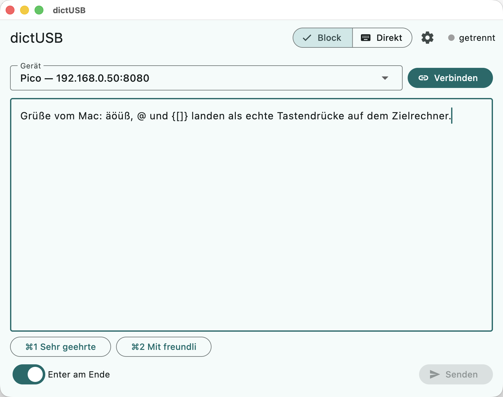
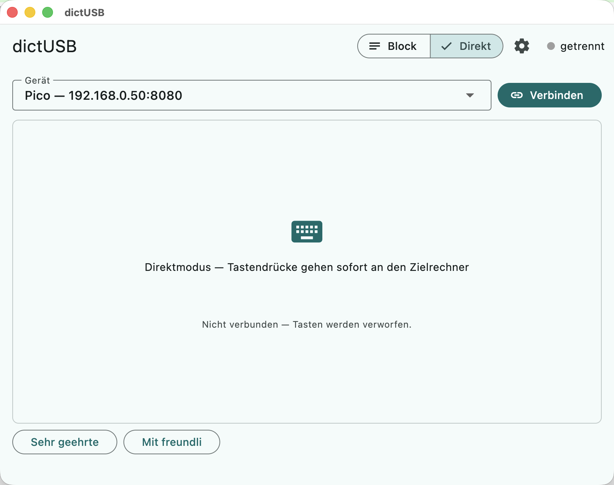

# dictUSB


> **English:** dictUSB types text live onto another computer. A
> microcontroller (Raspberry Pi Pico 2 W or ESP32-S3) plugs into the
> target machine via USB and acts as an ordinary HID keyboard; text is
> sent to it over WLAN, end-to-end encrypted. The target runs **zero
> software** — it works everywhere, even in BIOS or at login screens.
> Documentation is in German; an online translator works well on it.

Text live von einem Rechner auf einen anderen tippen. Ein Mikrocontroller
(Raspberry Pi Pico 2 W oder ESP32-S3) steckt per USB am Zielrechner und
gibt sich als HID-Tastatur aus; gesendet wird per WLAN (TCP,
verschlüsselt).

```
Sender (macOS/Linux/Windows) --(WLAN, TCP)--> Pico 2 W / ESP32-S3 --(USB-HID)--> Zielrechner
```

**Auf dem Zielrechner läuft keine Software** — er sieht eine ganz normale
Tastatur. Das funktioniert deshalb überall gleich (Windows, Linux, macOS,
sogar im BIOS oder am Anmeldebildschirm); zu beachten ist nur seine
Tastaturbelegung, siehe „Zielsysteme und Layouts".

| Rolle | Unterstützt |
|---|---|
| **Senden** | macOS, Linux, Windows — mit der dictUSB-App (`app/`, Flutter) |
| | macOS, Linux — zusätzlich mit dem Python-Client (`mac/dictusb.py`) |
| | Cmd↔Strg-Tausch global (`--tasten`): nur macOS, nur Python-Client |
| **Empfangen** | Windows und Linux mit deutschem oder US-Layout; macOS offen |

## Schnellstart

1. **Kaufen**: einen Mikrocontroller aus der Einkaufsliste (unten).
2. **Flashen**: CircuitPython + dictUSB-Firmware aufspielen
   („Pico einrichten" bzw. `ESP32.md`) und in `settings.toml` WLAN +
   Token eintragen.
3. **Einstecken**: Mikrocontroller per USB an den Zielrechner — er
   meldet sich dort als Tastatur und verbindet sich mit dem WLAN.
4. **App laden** (Downloads unten), IP + Token eintragen, **Verbinden**.
5. **Tippen oder diktieren** — der Text erscheint am Zielrechner.

## Downloads

Fertige Builds der dictUSB-App gibt es unter
**<https://github.com/stwaidele/dictusb/releases/latest>**:

| Datei | Für |
|---|---|
| `dictusb-app_macos.dmg` | macOS (signiert + notarisiert) |
| `dictusb-app_windows_amd64.zip` | Windows 10/11 (64-bit) |
| `dictusb-app_linux_amd64.tar.gz` | Linux (64-bit, braucht GTK 3) |

Jedes Release enthält eine `SHA256SUMS` zum Prüfen der Downloads
(`shasum -a 256 -c SHA256SUMS`).

**Beim ersten Start:**

- **macOS**: Das DMG ist signiert und notarisiert und startet ohne
  Warnung. Falls macOS doch warnt (z. B. bei einem Prerelease):
  Rechtsklick auf die App → „Öffnen".
- **Windows**: SmartScreen kennt die unsignierte App nicht — „Weitere
  Informationen" → „Trotzdem ausführen". Im Zweifel vorher die
  Prüfsumme gegen `SHA256SUMS` vergleichen.
- **Linux**: Archiv entpacken (legt ein Verzeichnis `dictUSB/` an),
  `./dictUSB/dictusb_app` starten (GTK 3 muss installiert sein).

<p>
  
  
</p>

Bedienung der App (Block-/Direktmodus, Diktat, Snippets,
Modifier-Mapping): [`app/README.md`](app/README.md).

## Einkaufsliste

Eines von beiden genügt (beide laufen mit identischer Firmware):

| Teil | ca. | Link |
|---|---|---|
| **Raspberry Pi Pico 2 W** (RP2350, WLAN) | 8 € | [Amazon-Suche](https://www.amazon.de/s?k=raspberry+pi+pico+2+w&tag=101010cloud-21)* |
| **ESP32-S3 DevKitC-1 „N16R8"** (16 MB Flash) | 10 € | [Amazon-Suche](https://www.amazon.de/s?k=esp32-s3+devkitc+n16r8&tag=101010cloud-21)* |
| Dazu: **USB-Datenkabel** (Pico: Micro-USB, ESP32: USB-C — kein reines Ladekabel) | 5 € | [Amazon-Suche](https://www.amazon.de/s?k=micro+usb+datenkabel&tag=101010cloud-21)* |

\* *Affiliate-Links (Werbung): Ein Kauf darüber unterstützt das
Projekt und kostet dich nichts extra.* Die Boards gibt es genauso bei
BerryBase, Reichelt & Co. — jedes DevKitC-1-Derivat mit nativem
USB-Anschluss tut es (Details zum getesteten ESP32-Board: `ESP32.md`).

## Pico einrichten

1. **CircuitPython flashen**: `.uf2` für „Raspberry Pi Pico 2 W" von
   <https://circuitpython.org/board/raspberry_pi_pico2_w/> laden
   (getestet mit 9.2.7 und 10.2.1). Bei einem Major-Wechsel müssen die
   `.mpy`-Libraries in `/lib` zur CircuitPython-Hauptversion passen
   (Bundle in der jeweiligen mpy-Variante laden); ob das DE-Layout
   geladen wurde, zeigt die Banner-Zeile `Layout = win_de` (statt
   `us (Fallback! …)`).

   **Bekannte Falle (CYW43-Funkchip, betrifft Entwicklung)**: Nach
   einem **Soft-Reboot** (Auto-Reload beim Speichern von Dateien,
   Ctrl-D im REPL) verklemmt der Funkchip gern — der Netz-Scan hängt
   dann und jede Verbindung scheitert mit „Unknown failure 1" (am AP
   sichtbar als kurzes Verbinden/Rausfliegen). Nur ein **harter Reset**
   (Strom trennen bzw. `microcontroller.reset()`) initialisiert ihn
   sauber. `code.py` enthält dafür einen Workaround: Nach 2
   Fehlversuchen löst es selbst einmalig einen Hardware-Reset aus
   (Marker in `microcontroller.nvm` verhindert eine Reset-Schleife).
   Im Normalbetrieb (Einstecken = Kaltstart) tritt das Problem nicht
   auf. Nach einem echten Kaltstart kann allerdings der **erste**
   Verbindungsversuch fehlschlagen (Chip-Initialisierung/leerer
   Scan-Cache) — der zweite sitzt dann; das fängt die Retry-Logik ab.
   BOOTSEL-Taste gedrückt halten, Pico an den Mac stecken, `.uf2` auf das
   erscheinende `RP2350`-Laufwerk kopieren. Danach erscheint `CIRCUITPY`.
2. **Libraries nach `CIRCUITPY/lib/` kopieren**:
   - `adafruit_hid/` aus dem [Adafruit-Library-Bundle](https://circuitpython.org/libraries)
   - `keyboard_layout_win_de.mpy` und `keycode_win_de.mpy` aus dem
     [Neradoc-Layout-Bundle](https://github.com/Neradoc/Circuitpython_Keyboard_Layouts/releases)
     (deutsches Windows-Layout; ohne sie fällt der Code auf US zurück)
3. **Dateien aus `firmware/` auf `CIRCUITPY/` kopieren**: `boot.py`, `code.py`,
   und `settings.toml.example` als `settings.toml` — dort SSID, Passwort
   und optional `DICTUSB_TOKEN` eintragen.
4. Pico aus- und am **Windows-PC** einstecken. Windows erkennt eine
   Tastatur; der Pico verbindet sich mit dem WLAN und lauscht auf Port 8080.
   (`boot.py` wirkt erst nach diesem Neustart.)

Die IP des Pico steht auf der seriellen Konsole (am Mac:
`screen /dev/tty.usbmodem* 115200`) — besser: im Router eine feste IP
vergeben.

## Mac-Client

```sh
# Interaktiv: jeder Tastendruck wird sofort getippt, Ende: 5x linke Shift
./mac/dictusb.py <pico-ip>

# Text/Dateien durchreichen
echo "Hallo Windows" | ./mac/dictusb.py <pico-ip>
cat notizen.txt | ./mac/dictusb.py <pico-ip>

# Mit Token (wenn DICTUSB_TOKEN gesetzt)
./mac/dictusb.py <pico-ip> --token geheim123

# Tasten-Modus: ALLE Tasten (auch Cmd-Kombis) abgreifen, Cmd<->Strg tauschen
./mac/dictusb.py <pico-ip> --token geheim123 --tasten
```

Ohne Client geht zum Testen auch `nc <pico-ip> 8080` (dann aber
zeilenweise, nicht pro Tastendruck).

Im interaktiven Modus werden **Strg+A..Z** als echte Strg-Kombination
an Windows durchgereicht (Strg+P → Druckdialog). Ausnahmen: Strg+H/I/J/M
wirken als Backspace/Tab/Enter.

**Beenden** (beide Modi): **5x die linke Shift-Taste innerhalb von
2 Sekunden**, ohne andere Taste dazwischen. Shift allein erzeugt keine
Eingabe — es muss nichts gepuffert oder verzögert werden, und Windows
bekommt von der Geste nichts mit (der Client sendet einzelne
Shift-Drücke nie, der Einrastfunktion-Dialog bleibt also aus). Im
interaktiven Modus läuft dafür ein pynput-*Beobachter* mit (ohne
Tastensperre; braucht dieselbe macOS-Freigabe wie `--tasten`) — fehlt
pynput oder die Freigabe, meldet der Client das und es bleibt nur
Ctrl+] (auf deutschem Mac-Layout nicht tippbar: Ctrl+Option+6 liefert
nur „6") oder das Schließen des Terminalfensters.

### Tasten-Modus (`--tasten`)

Greift per macOS-Event-Tap **alle** Tastenereignisse samt Modifiern ab —
nur so sieht der Client auch die Cmd-Taste, die das Terminal sonst
abfängt — und tauscht die Modifier für Mac-Muskelgedächtnis:
**Cmd+X → Strg+X** und **Strg+X → Win+X** (Alt/Shift bleiben, normaler
Text wird weiter als Text getippt, Pfeile/F-Tasten/Entf funktionieren).

- Voraussetzungen: `pynput` (`python3 -m pip install --user
  --break-system-packages pynput`) und einmalig die macOS-Freigabe
  **Bedienungshilfen** für das Terminal (Systemeinstellungen →
  Datenschutz & Sicherheit).
- Solange der Modus läuft, sind alle Tastendrücke **lokal unterdrückt**
  — der Mac reagiert erst nach dem Beenden wieder. Die Maus bleibt frei
  (notfalls Terminalfenster per Maus schließen, das löst den Event-Tap).
- Beenden: **5x linke Shift-Taste innerhalb 2 s** (ohne andere Taste
  dazwischen); Windows bekommt davon nichts mit.

## Web-Interface (Logs & Updates im Browser)

Mit gesetztem `CIRCUITPY_WEB_API_PASSWORD` in der `settings.toml` (siehe
Vorlage) startet CircuitPythons eingebauter **Web Workflow** auf Port 80:

- `http://<pico-ip>/fs/` — Dateibrowser: `code.py`/`settings.toml`
  ansehen, bearbeiten, hochladen (Speichern löst den Auto-Reload aus).
- `http://<pico-ip>/cp/serial/` — serielle Konsole im Browser: die
  dictUSB-Logs live, plus REPL.

Login jeweils: Benutzername **leer lassen**, Passwort =
`CIRCUITPY_WEB_API_PASSWORD`. Der Supervisor verbindet das WLAN dabei
selbst (vor `code.py`) und hält die Verbindung über Soft-Reboots — das
entschärft auch die CYW43-Falle unten. Damit braucht es zum Entwickeln
weder das `CIRCUITPY`-Laufwerk noch PuTTY; der Pico kann kopflos am
Windows-PC stecken bleiben.

Zum Hochladen aus dem Repo gibt es `mac/deploy.sh` (nutzt die
Web-Workflow-API per HTTP PUT):

```sh
./mac/deploy.sh                   # lädt firmware/code.py hoch
./mac/deploy.sh firmware/boot.py      # beliebige Dateien
```

Host und Passwort liest das Skript aus der lokalen (gitignorten) Kopie
`firmware/settings.toml` (`DICTUSB_HOST`, `CIRCUITPY_WEB_API_PASSWORD`);
die Umgebungsvariablen `DICTUSB_HOST`/`DICTUSB_WEB_PASSWORD` haben
Vorrang.

## Updaten & Recovery

`boot.py` schränkt nur die **HID-Geräteklasse** ein (nur Tastatur statt
Tastatur+Maus+…). Das `CIRCUITPY`-Laufwerk und die serielle Konsole bleiben
davon unberührt aktiv:

- **Normales Update**: neue `code.py` einfach aufs `CIRCUITPY`-Laufwerk
  kopieren — geht auch, während der Pico am Windows-PC steckt. CircuitPython
  lädt das Programm nach dem Speichern automatisch neu.
- **Notfall (Laufwerk erscheint nicht)**: BOOTSEL-Taste gedrückt halten beim
  Einstecken → der ROM-Bootloader des RP2350 meldet sich immer als
  `RP2350`-Laufwerk, egal was auf dem Pico installiert ist. Dort die
  CircuitPython-`.uf2` neu flashen (**erhält** das Dateisystem samt
  `settings.toml`) oder mit `flash_nuke.uf2` komplett löschen (letzte
  Instanz).
- **`CIRCUITPY`-Laufwerk**: `boot.py` deaktiviert es standardmäßig —
  solange der USB-Host das Laufwerk besitzt, darf die Web-API nicht
  schreiben (`409 Conflict` beim Upload), und ohne Laufwerk sieht der
  PC eine reine Tastatur. Updates laufen über das Web-Interface /
  `mac/deploy.sh`. Fürs Arbeiten am Kabel: `DICTUSB_USB_DRIVE = "1"`
  in der `settings.toml` setzen (per `/fs/` im Browser änderbar) und
  hart resetten. Notausstieg bleibt immer BOOTSEL.

## Zielsysteme und Layouts

Auf dem **empfangenden Rechner läuft keine Software** — er sieht eine
ganz normale USB-Tastatur. Genau daraus folgt die einzige Einschränkung:
Wir senden HID-Keycodes, und welches Zeichen daraus wird, entscheidet
die **Tastaturbelegung des Zielrechners**. Deshalb gehört das Layout zur
Konfiguration des Geräts (`DICTUSB_LAYOUT` in der `settings.toml`) — es
steckt ja dauerhaft an genau einem Rechner.

| Zielsystem | Einstellung | Stand |
|---|---|---|
| Windows, deutsches Layout | `win_de` (Standard) | abgenommen |
| Linux, deutsches Layout | `win_de` | abgenommen (Debian: Textkonsole/TTY, X11 und Wayland) |
| Windows/Linux, US-Layout | `us` | **ungetestet** (nur die Umschaltung auf `us` ist verifiziert) |
| weitere (fr, uk, es, it) | `win_fr`, … | nutzbar, sobald die `.mpy` in `/lib` liegt |
| **macOS** | — | **derzeit nicht unterstützt**, siehe unten |

Beim Start meldet das Gerät die aktive Belegung (`Layout = win_de`).
Ein unbekannter oder nicht installierter Wert fällt hörbar auf `us`
zurück, statt stumm falsche Zeichen zu tippen. Das US-Layout kennt keine
Umlaute — solche Zeichen werden protokolliert und verworfen.

### macOS als Ziel (offen, mit Lösungsweg)

Ein Mac als Empfänger funktioniert **nicht zuverlässig**: Buchstaben und
Umlaute kämen richtig an, aber `@ \ | { } [ ] ~` liegen auf dem Mac auf
der Wahltaste statt auf AltGr. Ein fertiges Modul dafür gibt es nicht —
das Neradoc-Bundle enthält nur ein französisches Mac-Layout, und sein
Generator arbeitet mit Windows-Tabellen.

Wer es angehen will, hat zwei Wege:

1. **`keyboard_layout_mac_de` von Hand ableiten**: `win_de` als Basis,
   `mac_fr` als Strukturvorlage für die Mac-Eigenheiten, dann die auf
   der Wahltaste liegenden Zeichen korrigieren.
2. **Mac auf US-Eingabequelle stellen** und ein `mac_us`-Modul bauen,
   das Umlaute über tote Tasten erzeugt (Wahltaste+U, dann `a` → `ä`).

In beiden Fällen gehört der Zeichensatz-Test aus dem nächsten Abschnitt
als Abnahme dazu.

### Zeichensatz-Test

Für jedes neue Ziel einmal senden und vergleichen:

```sh
echo 'äöüß ÄÖÜ @/\-_ yz YZ 123 {[()]}' | ./mac/dictusb.py <ip>
```

## Status-LED

Die Onboard-LED zeigt den Betriebszustand:

| Zustand | Anzeige |
|---|---|
| bereit (wartet auf Verbindung) | **gelb** |
| verbunden | **grün** bei 50 % Helligkeit |
| Tastendruck | kurz auf 100 %, blendet über 5 s zurück auf 50 % |
| Abbruch (Timeout/Fehler/Netzverlust) | **rot blinkend** ~3 s, dann wieder gelb |

**Ein Code, alle Boards**: `status_led.py` erkennt beim Start die
Hardware selbst (Bannerzeile `LED = …`):

- **RGB-LED** (z. B. ESP32-S3 mit NeoPixel auf `board.NEOPIXEL`, über
  das Core-Modul `neopixel_write` — keine Zusatz-Library nötig): voller
  Farbverlauf wie oben.
- **Einfarbige LED** (z. B. Pico 2 W, `board.LED` am Funkchip): kann
  keine Farbe/Helligkeit, daher Blinkmuster — bereit = langsames
  Blinken, verbunden = Dauerlicht, Abbruch = schnelles Blinken.
- **Keine LED**: der Code läuft unverändert weiter, es passiert nichts.

Konfiguration in der `settings.toml`:

- `DICTUSB_LED` — `"0"` schaltet die Anzeige ganz aus (Default `"1"`).
- `DICTUSB_LED_BRIGHTNESS` — Obergrenze der Helligkeit `0..1`
  (Default `0.5`; WS2812 bei `1.0` sind sehr grell). Die 100 %/50 % oben
  sind relativ zu dieser Obergrenze.
- `DICTUSB_LED_PIN` — nur nötig, wenn die RGB-LED eines Clones **nicht**
  auf `board.NEOPIXEL` sitzt (z. B. `"GPIO48"`). Leer = automatisch.

Kommen bei einem RGB-Board die Farben vertauscht an (Gelb wirkt z. B.
cyan), erwartet die LED eine andere Byte-Reihenfolge als GRB — dann in
`RgbBackend.show()` in `status_led.py` die Reihenfolge anpassen.

## Hinweise

- **Layout**: siehe Abschnitt „Zielsysteme und Layouts" — die Belegung
  des Zielrechners bestimmt, welche Zeichen ankommen.
- **Sicherheit/Verschlüsselung**: Sobald `DICTUSB_TOKEN` gesetzt ist,
  läuft der Tipp-Kanal verschlüsselt und integritätsgeschützt
  (Protokoll **DICTUSB2**, Details im Docstring von
  `firmware/dictusb_crypto.py`): Der Pico sendet pro Verbindung ein
  frisches Salt, beide Seiten leiten daraus per HMAC-SHA256
  Session-Schlüssel ab, Daten laufen als MAC-geschützte Frames
  (Keystream: HMAC als PRF im CTR-Modus). Das Token selbst wird nie
  übertragen; der erste gültige Frame authentisiert. Der Client
  verweigert Klartext, wenn ein Token gesetzt ist (kein Downgrade).
  Wichtig:
  - Das Token muss **hochentropisch** sein (z.B.
    `python3 -c 'import os; print(os.urandom(16).hex())'`) — die
    Ableitung ist sonst offline wörterbuch-angreifbar.
  - Beim Umstieg von der Klartext-Token-Version: erst beide Seiten
    updaten, dann das Token **rotieren** (das alte lief im Klartext).
  - Grenzen: Frame-Längen und Timing bleiben sichtbar
    (Keystroke-Timing), der Pico authentisiert sich nicht gegenüber
    dem Client, und das Web-Interface (Port 80) bleibt reines HTTP.
  Ohne Token: Klartext, jeder im WLAN kann tippen — nur für Tests
  (`nc` funktioniert nur in diesem Modus).
- **Steuerzeichen**: Enter, Tab, Backspace und Escape werden übertragen;
  Strg+A..Z kommen als Strg-Kombination an; übrige Steuerzeichen werden
  ignoriert.
- **Kombinations-Protokoll**: Die Escape-Sequenz `0x00` + Spezifikation +
  `\n` im Datenstrom tippt beliebige Kombinationen, z.B.
  `\x00ctrl+shift+p\n` oder `\x00win+e\n`. Modifier: `ctrl`, `alt`,
  `shift`, `win`; Taste: einzelnes Zeichen (layoutkorrekt) oder Name
  (`enter`, `tab`, `esc`, `delete`, `f1`–`f12`, `up/down/left/right`,
  `home`, `end`, `pageup`, `pagedown`, …) — siehe `send_combo()` in
  `firmware/code.py`. Der `--tasten`-Modus nutzt genau dieses Protokoll.

## Mitmachen

- **Fragen und Fehler**: als Issue auf
  <https://github.com/stwaidele/dictusb/issues>.
- **Sicherheitslücken**: bitte vertraulich melden — siehe
  [SECURITY.md](SECURITY.md).
- **Pull Requests** sind willkommen; die Entwicklung läuft primär auf
  einer privaten Gitea-Instanz, GitHub wird gespiegelt — PRs werden
  daher lokal gemergt und tauchen als normale Commits auf.
- Lizenz: [MIT](LICENSE).
