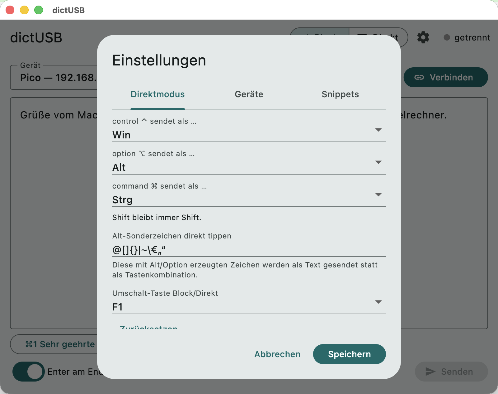

# dictUSB Flutter-Client (`app/`)

Plattformübergreifender **Sender**-Client (Desktop: macOS/Windows/Linux)
für dictUSB. Spricht DICTUSB2 (verschlüsselt) mit dem Gerät; die
Empfänger-Seite bleibt unverändert (Gerät = USB-HID-Tastatur).

```sh
cd app
flutter analyze && flutter test   # Krypto-Vektoren, Mapping, UI-Smoke
flutter run -d macos              # aus echtem Terminal starten!
```

**macOS-Falle „Lokales Netzwerk":** Die Freigabe gehört dem startenden
Prozess. Aus einem Wrapper/Harness gestartet scheitert Verbinden mit
„no route to host" — die App für Netz-Tests immer aus Terminal/iTerm2
starten. Vergisst macOS die Freigabe (nach Neustart/Update):
Systemeinstellungen → Datenschutz & Sicherheit → Lokales Netzwerk →
Terminal aus- und wieder einschalten, Terminal komplett neu starten.

## Modi

- **Blockmodus** (Start): Text ins Feld tippen oder diktieren, „Senden"
  überträgt ihn als Tastatureingabe. Das Feld ist auch ohne Verbindung
  nutzbar (vorab schreiben, später senden).
- **Direktmodus**: jeder Tastendruck geht sofort ans Gerät — Zeichen als
  Text, Strg+A…Z als Steuerbytes, Sondertasten (Pfeile, F-Tasten,
  Home/End …) als Kombi-Sequenzen (PROTOCOL.md §7). Ein **allein
  angetippter Modifier** (z. B. Shift — Down und Up ohne weitere Taste)
  wird beim Loslassen als reiner Modifier-Tipp gesendet, etwa um den
  Bildschirmschoner des Ziels zu beenden, ohne ein Zeichen zu tippen
  (braucht Firmware ≥ 0.18; das Mapping gilt auch hier). Lokales Echo
  verblasst nach ein paar Sekunden. Umschalten: Segmentknopf oder
  Taste (Default **F1**, einstellbar).

**Diktat (Paraspeech)** funktioniert in beiden Modi: Blockmodus → Text
landet im Feld; Direktmodus → Text geht direkt ans Gerät.

## Geräte und Snippets

- **Geräteliste** (Einstellungen → Geräte): benannte Einträge mit
  Host/Port und **Token je Gerät** (beim Anlegen wird das Token des
  ersten Geräts vorbelegt). Auswahl über das Dropdown in der
  Verbindungsleiste; ein Wechsel bei bestehender Verbindung trennt und
  verbindet neu. Die frühere Einzel-Konfiguration wird beim ersten
  Start automatisch zu „Gerät 1" migriert.
- **Snippets** (Einstellungen → Snippets): bis zu 9 Textbausteine als
  Knopfleiste unter dem Inhaltsbereich — in beiden Modi klickbar.
  Blockmodus: Baustein wird an der Cursorposition eingefügt, zusätzlich
  per **Cmd+1…9** (macOS) bzw. **Strg+1…9** erreichbar. Direktmodus:
  Klick sendet den Baustein sofort ans Gerät; Hotkeys gibt es dort
  bewusst nicht (jede Taste gehört dem Zielrechner).

## Einstellungen (Zahnrad)



- **Modifier-Mapping**: drei Dropdowns — was control/option/command
  (macOS) bzw. Strg/Alt/Win (Windows/Linux) am Ziel bewirken
  (`Strg`/`Alt`/`Win`). macOS-Default ist der bewährte Tausch
  Cmd→Strg, control→Win. Shift bleibt immer Shift.
- **Alt-Sonderzeichen direkt tippen**: Zeichenliste (Default
  `@[]{}|~\€`). Gelistete, mit Alt/Option komponierte Zeichen werden
  als Text gesendet; alle anderen Alt-Kombis gehen als Tastenkombination
  ans Ziel (z. B. `alt+f` für Menü-Shortcuts).
- **Umschalt-Taste** Block/Direkt: F1–F12.

Gespeichert wird plattformüblich (SharedPreferences), inklusive
Host/Port/Token aus der Verbindungsleiste.

## Grenzen

- **OS-reservierte Kombis** kann kein Client abfangen: macOS behält
  z. B. Cmd+Tab und **control+Pfeiltasten** (Spaces/Mission Control —
  löst lokal den Fenster-/Space-Wechsel aus), Windows Win+L/Win+D —
  solche Tasten erreichen die App nicht und können nicht gesendet
  werden.
- **Zeichenvorrat = Ziel-Layout**: Das Gerät kann nur Zeichen tippen,
  die das eingestellte Layout (`win_de`) über Tastendrücke erreicht.
  Typographische Anführungszeichen („ " ' — am Mac Alt+^/Alt+2) kommen
  deshalb in keinem Modus an; unter Windows gibt es sie nur als
  Alt-Nummernblock-Codes, die kein HID-Layout abbildet.
- Mobil (Touch) ist bewusst außen vor — dafür ist später ein eigener
  Client geplant. Android mit Hardware-Tastatur ist ungetestet.
- Der macOS-**Tasten-Modus** des Python-Clients (globaler Event-Tap,
  wirkt in allen Apps) bleibt Python-only; der Direktmodus wirkt nur,
  solange das App-Fenster fokussiert ist.

## Linux: Dock-Icon

Der Runner setzt beim Start das Fenster-Icon aus dem Bundle
(`data/app_icon.png`) — unter X11 zeigen Taskleiste/Dock damit direkt
das dictUSB-Symbol. **Unter GNOME mit Wayland** nimmt das Dock das Icon
dagegen aus einer installierten `.desktop`-Datei (Zuordnung über die
App-ID `info.waidele.dictusb_app`); ohne sie erscheint ein
Buchstaben-Platzhalter. Wer das Icon dort möchte, legt einmalig eine
`.desktop`-Datei an:

```sh
APPDIR=/pfad/zum/entpackten/dictUSB   # absoluten Pfad eintragen
cat > ~/.local/share/applications/info.waidele.dictusb_app.desktop <<EOF
[Desktop Entry]
Type=Application
Name=dictUSB
Exec=$APPDIR/dictusb_app
Icon=$APPDIR/data/app_icon.png
StartupWMClass=info.waidele.dictusb_app
Categories=Utility;
EOF
```

Danach startet die App auch aus der Aktivitäten-Übersicht; beim Start
über die Kommandozeile ordnet GNOME das Fenster über die App-ID zu.
